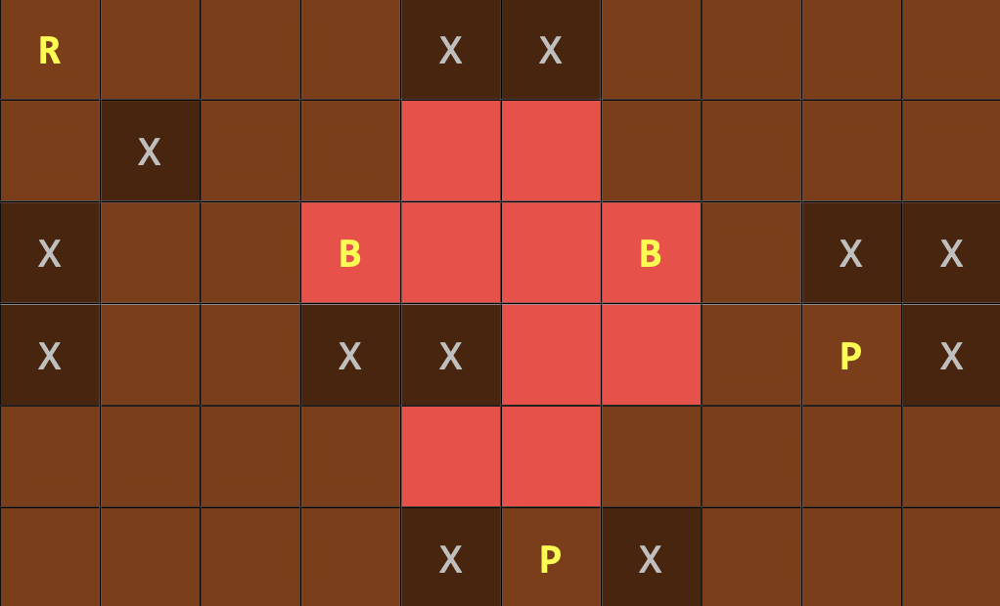

# RoboPush: Navigating a Board Game with Search Algorithms

This project implements three search algorithms, Iterative Deepening Search (IDS), Bidirectional Breadth-First Search (
BBFS), and A* algorithm from scratch, to solve a simple board game where a robot must push an object (a pat of butter) to a
destination (a plate) while avoiding fixed obstacles.



In the figure above, R represents the Robot, B's represent the butters, and P's represent the plates. Brown cells
have a cost of 1, and red cells have a cost of 2.

## Solution Algorithms

- **IDS Algorithm**: An iterative graph searching strategy that combines the benefits of Depth-First Search (DFS) and
  Breadth-First Search (BFS) while using less memory in each iteration.
- **Bidirectional BFS**: A graph search algorithm that runs two simultaneous searches, one forward from the initial
  state and one backward from the goal, stopping when the two meet. This approach is often faster than the traditional
  BFS.
- **A* Algorithm**: A search algorithm that finds the shortest path between an initial and a final point by combining
  actual and estimated costs using an admissible heuristic.

## Input and Output Formats

- Input format:

```
5	6
1	1	1	1	1	1
2	1	1b	1r	1b	2
2p	x	1	1	1	2
2	1	1	1	1	2
1	1	1	1	1	1p
```

The first line contains the number of rows and columns of the board. Each cell is represented by its cost, and its
objects (`r/robot`, `x/obstacle`, `b/butter` and `p/plate`).

- Output format:

```
R R U U L R D
12
7
```

The first line contains a minimal sequence of movements. The following lines contain the cost of the solution and the
depth of it.

## Implementation Details

For each algorithm, there is a script containing the solution code. For algorithms without heuristics (IDS and BBFS),
the cost of all cells is assumed to be 1. For the A* algorithm, a simple heuristic is used where distances from the
initial point to all destination plates are measured.

## Demo


## Run

```
python IDS.py [TESTCASE] input/test5.txt [MAX_DEPTH] 200
python BBFS.py [TESTCASE] input/test5.txt
python A_Star.py [TESTCASE] input/test5.txt [MAX_DEPTH] 250
```

The search algorithms are implemented from scratch. For the GUI visualization, a slightly modified version of
the [game2dboard](https://github.com/mjbrusso/game2dboard/) library is used.

## Course Information

- **Course**: Artificial Intelligence
- **University**: Amirkabir University of Technology
- **Semester**: Spring 2021

Let me know if you have any questions!
